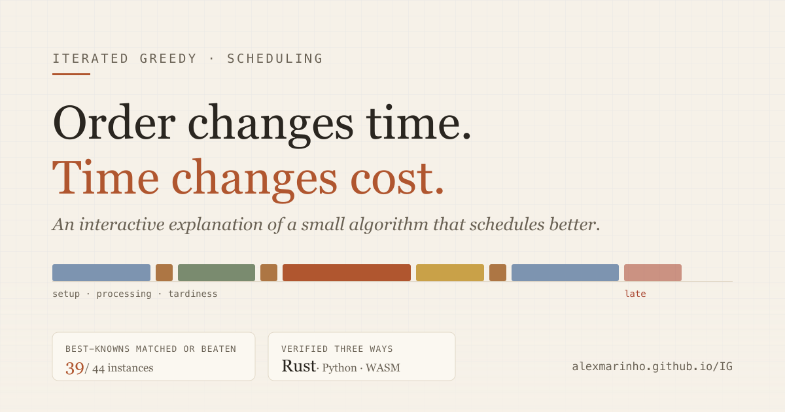
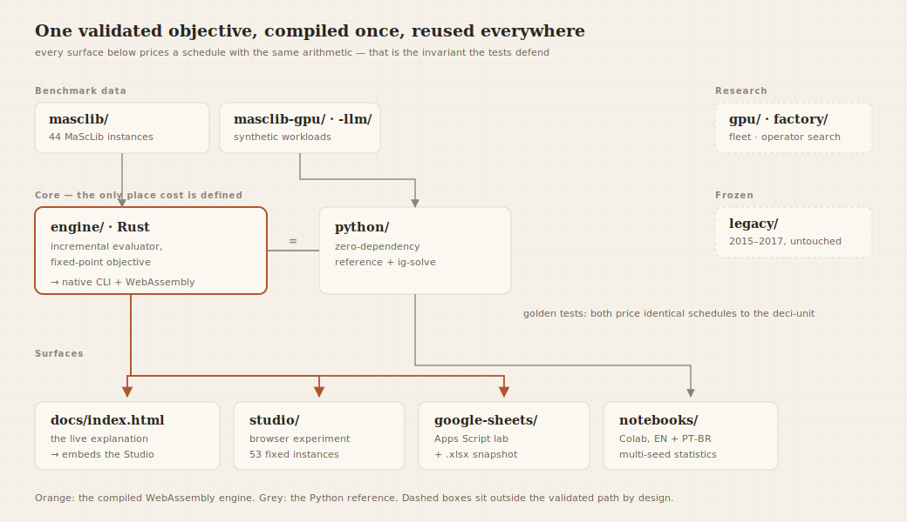

# Iterated Greedy Scheduling

[](https://github.com/alexmarinho/IG/actions/workflows/ci.yml)
[](https://alexmarinho.github.io/IG/)

[](https://alexmarinho.github.io/IG/)

A validated **Iterated Greedy** solver for single-machine scheduling with job rejection,
tardiness penalties, release dates and sequence-dependent setup time and cost — the
*order acceptance and scheduling* family, `1 | rⱼ, sᵢⱼ | Σ wⱼTⱼ + rejection`.

Across the 44 MaScLib benchmark instances it **matches or beats the published
best-known value on 39**, and improves two of them. The Rust core evaluates roughly
**20M candidate schedules per second per core**, and compiles to WebAssembly — so the
same engine that produced those numbers is the one running in your browser.

**[▶ Open the interactive explanation](https://alexmarinho.github.io/IG/)** — bilingual,
no installation. Or solve something in two lines:

```bash
git clone https://github.com/alexmarinho/IG && cd IG
python3 python/ig_scheduler.py solve masclib/NCOS_01.csv --seconds 3
```

```text
NCOS_01: n=8 best=800 iters=119177 evals=3218727 (1073k evals/s) t=3.00s
  performed 2 / rejected 6
```

`best=800` is the published best-known value for that instance. Six of the eight jobs
are *rejected* on purpose — turning them away costs less than the setup, processing and
lateness of running them. That trade-off is the whole problem.

### Which surface do you want?

| To… | Go to |
|---|---|
| understand the idea, interactively | **[the live explanation](https://alexmarinho.github.io/IG/)** |
| read the model and the method | [`docs/algorithm.md`](docs/algorithm.md) |
| check whether it actually works | [`RESULTS.md`](RESULTS.md) |
| install and run it yourself | [Run it](#run-it) |
| know when *not* to use it | [Scope and limitations](#scope-and-limitations) |

The original 2015–2017 implementation is preserved under [`legacy/`](legacy/).

## The scheduling problem

One machine receives jobs from several families. Every job has a release date, processing time, due date, tardiness weight and rejection cost. Moving from one family to another may require a setup whose duration and cost depend on the preceding family.

The decision is therefore twofold:

1. Which jobs should be performed, and in what order?
2. Which jobs should remain outside the machine because rejection costs less than setup, processing and delay?

The objective combines all consequences in one comparable value:

```text
total cost = setup cost + processing cost + weighted tardiness + rejection cost
```

Changing only the order can change setup transitions, completion times, late jobs and the set of accepted jobs. Exhaustively testing every order becomes impractical quickly: 28 jobs already have about 3.05 × 10²⁹ complete permutations before rejection choices are considered.

The original application is make-to-order production on one machine. The same mathematical structure can also represent a GPU serving several models, a central kitchen adjusting planned production, or an operating-room block with procedure-dependent room changes. These mappings are explanatory single-machine models, not complete operational systems.

## The method

The Iterated Greedy search extends the standard destroy-and-rebuild cycle with rejection:

1. **Construct** an initial schedule by evaluating every insertion position.
2. **Destroy** a small part of the current sequence.
3. **Rebuild** by reinserting pending jobs where each produces the lowest complete cost.
4. **Swap** scheduled and rejected jobs when that operator is enabled.
5. **Accept** the candidate when it improves the selected reference state, then repeat.

A dynamic break-even deadline is recomputed from the real position-dependent setup, processing, tardiness and rejection costs. A job remains rejected whenever every feasible insertion is more expensive than leaving it out.

The algorithm and objective are explained in detail in [`docs/algorithm.md`](docs/algorithm.md).

## What was modernized

| Area | Current implementation |
|---|---|
| Historical project | Original Python/PyQt, Excel/VBA, images and inputs preserved under [`legacy/`](legacy/) |
| Core engine | Rust native CLI and WebAssembly module with incremental downstream evaluation and fixed-point objective arithmetic |
| Python reference | One-file, zero-runtime-dependency package and `ig-solve` CLI with the same validated objective semantics |
| Interactive explanation | Self-contained EN/PT-BR animated-paper presentation covering order effects, combinatorial growth, the IG cycle and recorded comparisons |
| Browser experiments | IG Studio with one-run and equal-budget multi-seed analysis over 53 fixed instances |
| Scientific analysis | Synchronized English and PT-BR notebooks with exhaustive small-case verification, convergence, restart and sensitivity experiments |
| Spreadsheet laboratory | Google Sheets/Apps Script interface backed by the canonical WebAssembly engine, plus a downloadable analytical workbook |
| Data | 44 MaScLib benchmarks, three GPU-serving workloads and six deterministic kitchen/surgery workloads |
| Research extensions | Adaptive destruction, a GPU replica-fleet prototype and a tested destroy-operator evolution harness |
| Verification | Property, cross-engine golden, benchmark regression, browser, Studio and spreadsheet contract tests in CI |

## Results and validation

Under one uniform protocol of 45 seconds × 3 seeds per instance, the Rust engine matched or beat the 2015 known reference on **37 of 44** MaScLib instances. Dedicated adaptive-destruction runs close two additional stagnation cases, bringing the documented scorecard to **39 of 44**. The remaining five gaps are at most 0.34% except `STC_NCOS_41a` at 2.44%.

Two values improve the recorded 2015 references:

| Instance | 2015 reference | Modern result |
|---|---:|---:|
| `NCOS_31` | 9,510 | **9,420** |
| `STC_NCOS_32` | 24,068 | **24,054** |

These are best-known references rather than general proofs of optimality. The complete protocols, per-instance table, negative results and implementation limits are documented in [`RESULTS.md`](RESULTS.md).

The evaluation is checked at three independent levels:

- a Rust property test compares incremental updates with a from-scratch oracle;
- Rust and Python price identical schedules to the same fixed-point value;
- deterministic benchmark regressions verify search behavior on real instances.

## Run it

### Browser

The published page includes the complete WebAssembly engine and fixed catalog:

<https://alexmarinho.github.io/IG/>

To serve the same self-contained build locally:

```bash
python3 -m http.server 8642 --directory docs
```

Then open <http://localhost:8642/>.

### Python

Python 3.10 or newer is required; the package has no runtime dependencies.

```bash
pip install git+https://github.com/alexmarinho/IG
ig-solve masclib/NCOS_31.csv --seconds 5
```

Or run it directly from a checkout:

```bash
git clone https://github.com/alexmarinho/IG.git
cd IG
python3 python/ig_scheduler.py solve masclib/NCOS_31.csv --seconds 5
python3 python/ig_scheduler.py validate masclib benchmark.json --seconds 2
```

Library use:

```python
from ig_scheduler import Instance, solve

instance = Instance.parse("masclib/NCOS_31.csv")
result = solve(instance, seconds=5.0)
print(result.best_cost, result.order, result.rejected)
```

### Rust

```bash
cd engine
cargo run --release -- solve ../masclib/NCOS_31.csv --seconds 10
cargo run --release -- validate ../masclib ../benchmark.json --seconds 45 --runs 3
cargo test --release
```

### Studio and notebooks

```bash
npm --prefix studio test
npm --prefix studio run check
npm --prefix studio run build
python3 studio/notebooks/build_notebooks.py
```

The standalone Studio build is [`studio/dist/index.html`](studio/dist/index.html). The executable notebooks are available in [`studio/notebooks/`](studio/notebooks/), with Colab links for both languages.

### Google Sheets

- [Inspect the completed read-only workbook](https://docs.google.com/spreadsheets/d/18i8zJqT0W6P8xcN1sn6NW0KjdEFYrAJm9zcVqb8fOXg/edit?usp=sharing)
- [Create an independent runnable copy](https://docs.google.com/spreadsheets/d/18i8zJqT0W6P8xcN1sn6NW0KjdEFYrAJm9zcVqb8fOXg/copy)
- [Download the generated `.xlsx`](google-sheets/dist/ig-scheduling-lab.xlsx)

The Apps Script engine and workbook contract are documented in [`google-sheets/README.md`](google-sheets/README.md).

## Repository map



| Path | Purpose |
|---|---|
| [`engine/`](engine/) | Canonical Rust engine, CLI, WebAssembly exports and tests |
| [`python/`](python/) | Readable zero-dependency Python engine and CLI |
| [`docs/`](docs/) | Self-contained public site, algorithm notes and research briefs |
| [`studio/`](studio/) | Browser analytics workspace, fixed catalog and scientific notebooks |
| [`google-sheets/`](google-sheets/) | Spreadsheet laboratory, Apps Script and downloadable workbook |
| [`masclib/`](masclib/) | 44 original benchmark instances |
| [`masclib-gpu/`](masclib-gpu/) | Three native GPU-serving workloads |
| [`masclib-domains/`](masclib-domains/) | Six kitchen and surgery explanatory workloads |
| [`masclib-llm/`](masclib-llm/) | Semantic manifests that map the historical instances to model-serving terms without changing their numbers |
| [`factory/`](factory/) | Reproducible destroy-operator evolution harness |
| [`gpu/`](gpu/) | Experimental PyTorch replica fleet |
| [`tools/`](tools/) | Deterministic builders and workload generators |
| [`legacy/`](legacy/) | Preserved 2015–2017 Python/PyQt and Excel/VBA project |

## Reproduce the release checks

```bash
cargo test --release --manifest-path engine/Cargo.toml
python3 python/test_ig_scheduler.py
python3 factory/test_factory.py
npm --prefix studio test
npm --prefix studio run check
npm --prefix studio run build
node --test google-sheets/tests/*.test.mjs
```

Deterministic seeds and equal iteration budgets are used wherever results are compared, so the
quality numbers above do not depend on the machine that produced them. Throughput figures
(~20M evaluations/s/core in Rust, ~1M/s in the Python reference) *are* hardware-specific and are
quoted as measured context, not as a benchmark claim.

## Scope and limitations

- The canonical model is single-machine scheduling. Parallel and heterogeneous machines remain future work.
- Kitchen, surgery and GPU scenarios are deterministic mappings for explanation and experiment; they are not operational, clinical or service-level recommendations.
- The GPU fleet is a correctness and diversity prototype and is currently slower than the optimized CPU engine for single-instance search.
- The first evolved destroy operators did not improve held-out results over uniform random destruction. That negative result is retained as the baseline for future work.

**When not to use this.** Reach for something else if your shop has parallel or
heterogeneous machines, if jobs have multi-operation routings, or if you need a
real-time dispatcher reacting to live events — this solves one machine, offline. For
small instances where you need a *proven* optimum rather than a very good schedule, use
an exact solver (CP-SAT or MILP); the 2015 study's one-hour MILP reference is reported
alongside the heuristics in the [live comparison](https://alexmarinho.github.io/IG/).

## Historical implementation

The original repository state remains available under [`legacy/`](legacy/), including its Python/PyQt interface, Excel/VBA workbook, images and MaScLib inputs. It is preserved for provenance and comparison; new work should use the root-level Rust or Python implementation.

The original 2015 monograph is [`docs/monografia-2015.pdf`](docs/monografia-2015.pdf).

## Resumo em português

Modernização reproduzível do Iterated Greedy para sequenciamento em máquina única com rejeição de tarefas, penalidade de atraso, datas de chegada e setups dependentes da sequência. A implementação histórica está preservada em [`legacy/`](legacy/). A raiz reúne o motor Rust nativo/WASM, a referência Python sem dependências, a explicação interativa EN/PT-BR, o ambiente de experimentos no navegador, notebooks científicos, a planilha Google Sheets/Apps Script, os benchmarks e os testes.

No protocolo uniforme de 45 segundos × 3 sementes, o motor iguala ou supera 37 das 44 referências de 2015. Execuções adaptativas documentadas elevam o total para 39/44, incluindo novos valores de referência em `NCOS_31` e `STC_NCOS_32`. Veja os protocolos e limites em [`RESULTS.md`](RESULTS.md).

## Citation and license

Citation metadata and the preferred 2015 thesis reference are provided in [`CITATION.cff`](CITATION.cff).

GPL-3.0 — see [`LICENSE.txt`](LICENSE.txt).
