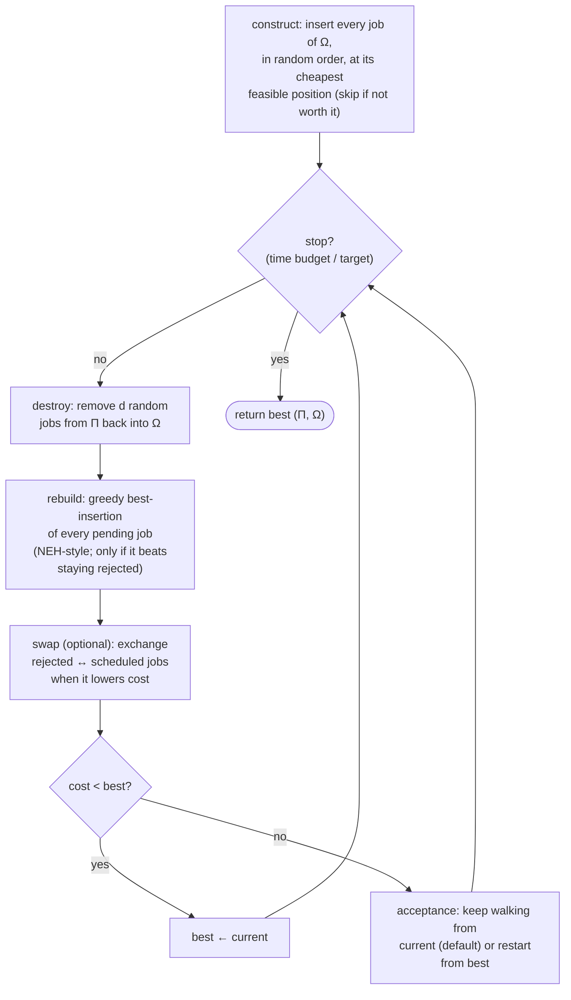
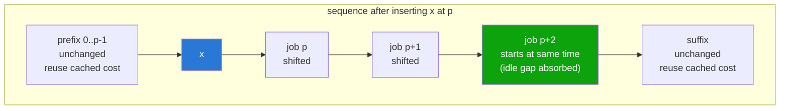

# The algorithm, explained

*(Full formal treatment of the model: the [2015 monograph](monografia-2015.pdf), chapter 3.)*

## The problem in one picture

One machine, jobs from different **families**. Switching families costs setup **time and money** (dependent on the *previous* job). Each job has a release date, a due date with a linear tardiness penalty — and a **rejection cost**: the machine may refuse a job and pay for it.

```mermaid
gantt
    dateFormat X
    axisFormat %s
    section machine
    setup A→B (time+cost)  :crit, 0, 8
    job 4 (family B)       :active, 8, 30
    job 7 (family B, free setup) :active, 30, 47
    setup B→A              :crit, 47, 59
    job 2 (family A, late → penalty) :done, 59, 80
    section rejected
    job 5 — pays rejection cost :milestone, 0, 0
```



Objective: **minimize setup costs + mode costs + weighted tardiness + rejection costs.**
In Graham notation: `1 | rⱼ, sᵢⱼ, d̄ⱼ | Σ fⱼ(Cⱼ) + Σ uⱼ + Σ cᵢⱼ` — strongly NP-hard.

## Solution representation

A solution is the pair **(Π, Ω)**: the sequence of performed jobs and the set of rejected ones. Every job is in exactly one of them.

## The Iterated Greedy loop




The destruction size *d* is the exploration dial: typical settings are *d*=2 for most instances and *d*=50 for the 500-job ones (many identical jobs). The acceptance choice matters too: walking from the *current* solution diversifies; restarting from *best* intensifies.

## The dynamic deadline d̄ⱼ

A job should be rejected the moment performing it costs more than its rejection price. Earlier formulations computed that break-even from the rejection cost alone; the dynamic variant folds in **setup and processing** — and since the setup depends on the job's position in the sequence, the deadline *moves* as the schedule changes:

```
d̄ⱼ = min( END_MAX, max( dⱼ, dⱼ + (uⱼ − setup_cost − processing_cost) / wⱼ ) )
```

Reading it: after `d̄ⱼ`, tardiness alone makes the job more expensive than paying `uⱼ` to reject it — so positions past that point don't need to be evaluated at all.

## The 2026 engine: incremental evaluation

The 2015/2017 implementations recomputed the whole schedule for every candidate insertion (`O(n)` per candidate, `deepcopy` on top in Python). The fix is incremental evaluation: after inserting at position *p*, only downstream jobs change — and the recomputation can stop at the first job whose start is **absorbed by an idle gap** (its times, and everything after it, are unchanged).



With cached per-position finish times and cumulative costs, a candidate evaluation costs `O(k)` where *k* is the number of jobs until absorption — usually a handful. That single change is worth **100–1000×**, and it is why the [Rust engine](../engine/) evaluates ~20M candidates/second/core and the [modern Python rewrite](../python/) runs ~300k/s where the 2017 version managed a few hundred.

## Reproducing the 2015 numbers

```bash
cd engine
cargo run --release -- validate ../masclib ../benchmark.json --seconds 45 --runs 3
```

Expected: 37+/44 matched-or-beat, with independent rediscovery of two best-known-solution improvements over the 2015 literature (`NCOS_31`, `STC_NCOS_32`). See the main [README](../README.md#the-modern-engine-engine-rust) for the semantics notes recovered while porting (fractional weights, mode cost, the `benchmark.json` typo).

## Sources and lineage

Three published anchors sit under this work. They were previously recorded only in
the project wiki, which has been retired — so they live here now.

- **The metaheuristic** — Ruiz, R. & Stützle, T. (2007). *A simple and effective
  iterated greedy algorithm for the permutation flowshop scheduling problem.*
  European Journal of Operational Research.
  [doi:10.1016/j.ejor.2005.12.009](https://doi.org/10.1016/j.ejor.2005.12.009).
  The destruction/construction skeleton this project extends.
- **The problem and the comparison set** — Thevenin, S., Zufferey, N. & Widmer, M.
  (2015). *Metaheuristics for a scheduling problem with rejection and tardiness
  penalties.* Journal of Scheduling.
  [doi:10.1007/s10951-014-0395-8](https://doi.org/10.1007/s10951-014-0395-8).
  Source of the six published heuristics and the MILP reference reported in the
  [live comparison](https://alexmarinho.github.io/IG/).
- **The instance library** — Nuijten, W., Bousonville, T., Focacci, F., Godard, D.
  & Le Pape, C. (2003). *Towards an industrial manufacturing scheduling problem and
  test bed* —
  [MaScLib](https://www.researchgate.net/publication/281228499_Towards_an_industrial_Manufacturing_Scheduling_Problem_and_Test_Bed).
  The 44 instances under [`masclib/`](../masclib/).
- **Background** — Pinedo, M. *Scheduling: Theory, Algorithms, and Systems.*
  Springer. On why single-machine models earn their keep.

The 2015 monograph this repository grew out of is
[`docs/monografia-2015.pdf`](monografia-2015.pdf); see [`CITATION.cff`](../CITATION.cff)
for how to cite the software itself.
