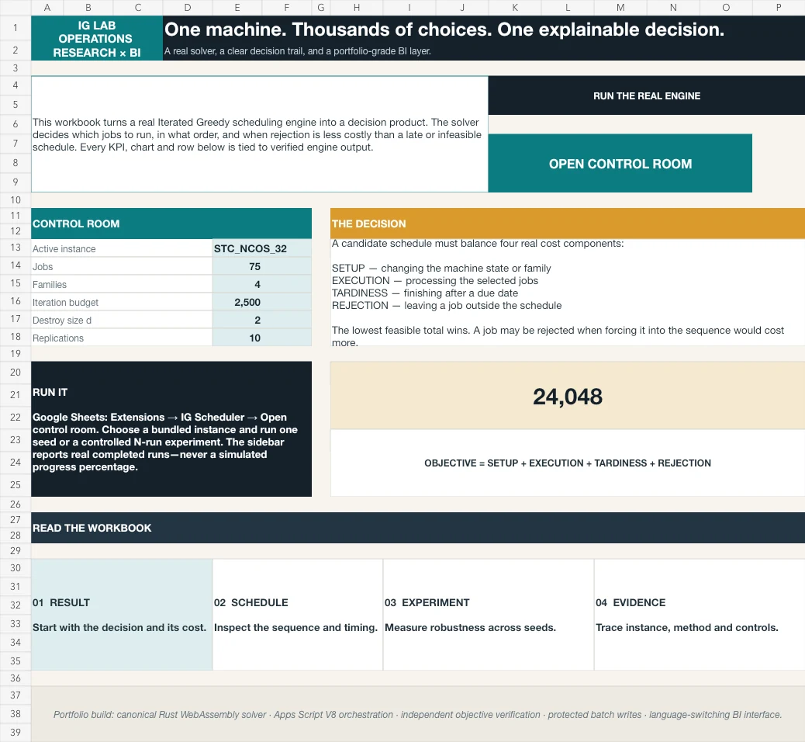
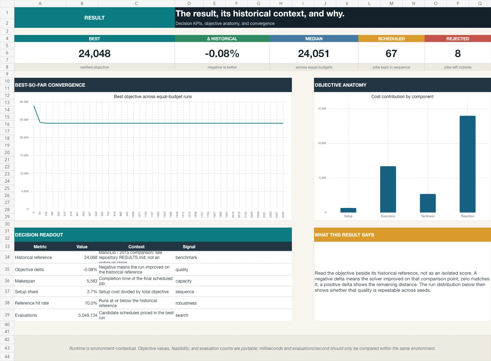
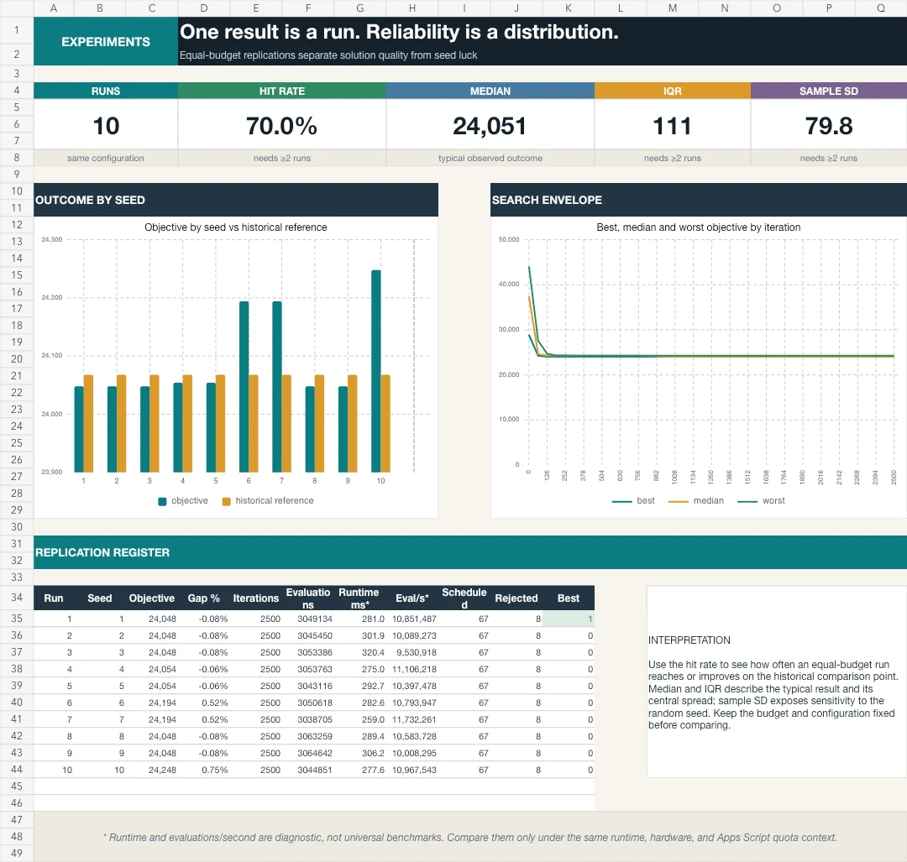
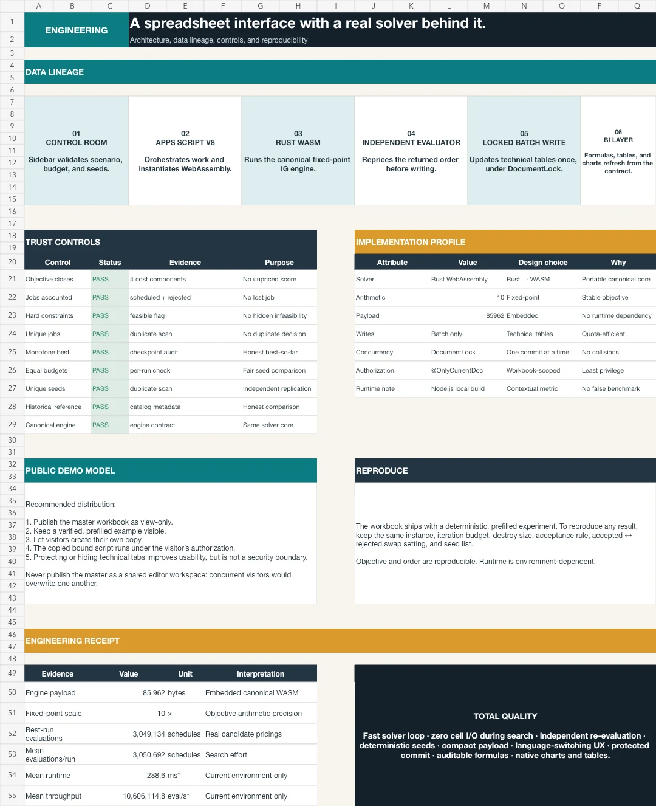

# IG Scheduling Lab — Google Sheets + Apps Script

A portfolio-grade operations-research workbook: the spreadsheet is the BI and
interaction layer, while the canonical Rust Iterated Greedy engine runs inside
Apps Script V8 as embedded WebAssembly.

This is not a toy reconstruction of the solver. A returned sequence is priced
again by an independent JavaScript evaluator before any result reaches the
workbook.

## Start here: choose the right version

| Goal | Open | What to expect |
|---|---|---|
| Inspect the completed BI analysis | [Public native master](https://docs.google.com/spreadsheets/d/18i8zJqT0W6P8xcN1sn6NW0KjdEFYrAJm9zcVqb8fOXg/edit?usp=sharing) | Read-only portfolio view with verified results |
| Run the solver and save new results | [Create a private Google Sheets copy](https://docs.google.com/spreadsheets/d/18i8zJqT0W6P8xcN1sn6NW0KjdEFYrAJm9zcVqb8fOXg/copy) | Bound Apps Script, private controls and writable results |
| Download or inspect offline | [`dist/ig-scheduling-lab.xlsx`](dist/ig-scheduling-lab.xlsx) | Formulas, tables, charts and the completed example; no bound Apps Script |

To run the native version:

1. Open the `/copy` link and create the private copy.
2. In that copy, choose **IG Scheduler → Verify embedded engine**.
3. Approve access to the current spreadsheet once.
4. Close and reopen **IG Scheduler → Open control panel**.

Importing the `.xlsx` into Google Sheets does not attach the container-bound
Apps Script project. It remains a useful analytical snapshot, but its solver
buttons cannot execute. Always begin with the native `/copy` link when the goal
is to run the scheduler.

Some accounts governed by Google Advanced Protection or an organization policy
may block Apps Script authorization. Keep the read-only portfolio for
inspection or create the runnable copy with a Google account that permits Apps
Script; do not weaken account security for this demonstration. Google documents
the restriction in its
[Advanced Protection FAQ](https://support.google.com/accounts/answer/7539956?hl=en).

## What the workbook demonstrates

- A clear problem statement before algorithm controls.
- One-seed and equal-budget multi-seed experiments.
- Objective composition: setup + execution + tardiness + rejection.
- Convergence, distribution, schedule/Gantt, job and family analysis.
- Normalized analytical tables, consistent dimensions and audit checks.
- One-language-at-a-time EN / PT-BR presentation without changing the data model.
- Reproducible seeds, fixed iteration budgets and explicit engine metadata.
- A real server-side control room with honest progress and real checkpoints.

The public-master case is `STC_NCOS_32`, a 75-job single-machine manufacturing
instance with sequence-dependent setups. Ten real 2,500-iteration runs produce
all four objective components. The best bundled demonstration run costs
`24,048`, compared with the historical known reference `24,068`; “known
reference” is deliberately not called an optimum.

Benchmark provenance is kept beside the project evidence: the instance comes
from MaScLib, the reference is the 2015 comparison value, and the complete
per-instance reproduction table is in [`RESULTS.md`](../RESULTS.md).

## Visual tour

The workbook uses an industrial editorial system instead of a generic dashboard
template. Every visible page has one analytical purpose and the same measures
remain traceable to the normalized technical tabs.







The control-room sidebar adds the interactive layer: real indeterminate work
feedback while the engine runs, completed-run progress for experiments, and an
animated line replay drawn from the returned checkpoints. It never invents a
percentage for work that Apps Script cannot observe.

The language selector is not side-by-side copy. English is the clean default;
choosing PT-BR switches the entire presentation in place: sheet names, titles,
explanations, table labels, chart titles/legends, menus and regional number
formatting. The underlying numerical and audit tables never change.

## Product surfaces

| Surface | Purpose |
|---|---|
| Public master — Viewer | Immutable portfolio view with a completed, real experiment |
| Personal copy — Owner | Runs the bound solver and stores private results |
| `.xlsx` release | Downloadable analytical workbook with the completed example |
| GitHub source | Workbook build, Apps Script, embedded payload generator and tests |

Live portfolio links:

- [Open the completed native Google Sheet](https://docs.google.com/spreadsheets/d/18i8zJqT0W6P8xcN1sn6NW0KjdEFYrAJm9zcVqb8fOXg/edit?usp=sharing)
- [Make an independent runnable copy](https://docs.google.com/spreadsheets/d/18i8zJqT0W6P8xcN1sn6NW0KjdEFYrAJm9zcVqb8fOXg/copy)

Both links point to the same workbook. The first is the read-only portfolio
view; the second creates a private copy whose `IG Scheduler` menu can switch
the complete interface between English and PT-BR.

The public master must never be shared as `Editor`. Google does not provide a
safe “viewer who may mutate only through this button” mode for a bound script.
Visitors use **File → Make a copy**; their copy includes the bound project and
their runs never collide with another visitor’s state.

For a portfolio link, publish the master as **Viewer**. Use its normal `/edit`
URL when the completed analytical example should open first, or replace the URL
suffix with `/copy` when the call to action should immediately create an
independent runnable copy.

## Workbook model

Visible analytical tabs:

1. `START`
2. `DASHBOARD`
3. `SCHEDULE`
4. `EXPERIMENTS`
5. `INSTANCE`
6. `METHOD`
7. `ENGINEERING`

In PT-BR mode these become `INÍCIO`, `RESULTADO`, `PROGRAMAÇÃO`,
`EXPERIMENTOS`, `INSTÂNCIA`, `MÉTODO` and `ENGENHARIA`. Only one language is
visible at a time.

Technical tabs hold normalized catalog, run, checkpoint, schedule, instance,
setup, chart-helper, translation and audit data. They are hidden in the public
master for presentation, not treated as a security boundary.

```text
Google Sheets controls + analytical views
                    ↓
Apps Script V8 orchestration (@OnlyCurrentDoc)
                    ↓
embedded ig_core.wasm + compressed bundled catalog
                    ↓
real checkpoints + best sequence + fixed-point objective
                    ↓
independent JavaScript repricing and contract checks
                    ↓
one batched write to normalized workbook tables
```

There are no external runtime services, credentials, uploads or generated
problem instances in this edition.



## Repository layout

- `apps-script/` — bound project source and least-privilege manifest.
- `generated/Payload.gs` — generated WebAssembly and compressed catalog.
- `generated/sample-data.json` — deterministic real public-master experiment.
- `scripts/build-payload.mjs` — packages the canonical engine and catalog.
- `scripts/generate-sample.mjs` — executes and independently evaluates the
  public-master experiment.
- `scripts/audit-catalog.mjs` — compares bundled cases for analytical richness.
- `scripts/build-workbook.mjs` — creates and renders the `.xlsx` workbook.
- `scripts/normalize-workbook.py` — removes generator-specific theme metadata
  from the distributed `.xlsx` and verifies the public artifact.
- `scripts/prepare-apps-script.mjs` — creates both a flat clasp-ready project
  and a browser-editor-friendly single-file server bundle.
- `tests/` — engine, evaluator, source and workbook-contract checks.
- `dist/ig-scheduling-lab.xlsx` — generated workbook for download/import.

The committed `.xlsx` opens in English and contains no duplicated bilingual
panels. Its formulas are already language-reactive; the bound Apps Script is
what exposes the switch and localizes sheet/chart chrome in a native Google
Sheet.

## Rebuild and verify

The Rust WASM target must already be installed.

```bash
RUSTFLAGS="-C panic=abort" cargo build --release \
  --target wasm32-unknown-unknown --no-default-features \
  --manifest-path engine/Cargo.toml

node google-sheets/scripts/build-payload.mjs
IG_SHEETS_INSTANCE=STC_NCOS_32 node google-sheets/scripts/generate-sample.mjs
node google-sheets/scripts/build-workbook.mjs
node google-sheets/scripts/prepare-apps-script.mjs
node --test google-sheets/tests/*.test.mjs
```

The workbook builder requires an optional maintainer-only spreadsheet
generation package. End users do not need that package: use the committed
`.xlsx` or copy the native Google Sheet. The normalization script uses only the
Python standard library.

## Attach the bound Apps Script

### Manual, one-time template setup

1. Import `dist/ig-scheduling-lab.xlsx` into Drive as a native Google Sheet.
2. Open **Extensions → Apps Script**.
3. Run `node google-sheets/scripts/prepare-apps-script.mjs` locally. For the
   shortest browser-editor path, replace `Code.gs` with
   `dist/apps-script-single-file/Code.gs`, then add
   `dist/apps-script-single-file/Sidebar.html`. The individual source files in
   `apps-script/` plus `generated/Payload.gs` are equivalent.
4. Replace the project manifest with
   `dist/apps-script-single-file/appsscript.json`.
5. Reload the Sheet and run **IG Scheduler → Verify embedded engine**.
6. Run **IG Scheduler → Install / refresh dashboard button** once. This places
   a transparent over-grid image on the styled `START!K7:O9` call to action and
   assigns `showIgSidebar`; the visible design remains native cell formatting.
7. Open **IG Scheduler → Open control panel**, switch once between **EN** and
   **PT-BR**, run one seed and run an experiment, then confirm the model checks
   on `METHOD` / `MÉTODO`.

If the menu, sidebar or authorization flow selects the wrong Google account,
retry in a private/incognito window signed in only to the account that owns the
copy. Google documents that multi-login is not supported for Apps Script
projects, add-ons or web apps in its
[official troubleshooting guide](https://developers.google.com/apps-script/guides/support/troubleshooting#issues_with_multiple_google_accounts).

### Repeatable updates with clasp

After the first bound project exists:

```bash
node google-sheets/scripts/prepare-apps-script.mjs
cd google-sheets/dist/apps-script
cp .clasp.json.example .clasp.json
# Replace the placeholder with the bound Apps Script project ID.
clasp push
```

Never commit `.clasp.json`, OAuth tokens or local clasp credentials.

## Release checklist

- Engine verification passes in Apps Script, not only in Node.
- One-seed and 10-seed runs complete from the sidebar.
- `scheduled + rejected = jobs` and every job appears once.
- Every scheduled job meets its hard deadline.
- Objective components close to the engine total within one deci-unit.
- Checkpoint iterations/evaluations are monotone; best cost never increases.
- Multi-seed runs use one instance and the same iteration budget.
- Dashboard, schedule, experiments and instance tabs have no formula errors.
- EN → PT-BR → EN changes every presentation surface without changing results.
- Public master is **Anyone with the link → Viewer**, with copying enabled.

## Segurança e uso em português

A planilha pública é somente leitura. Para executar, abra o
[link nativo de cópia](https://docs.google.com/spreadsheets/d/18i8zJqT0W6P8xcN1sn6NW0KjdEFYrAJm9zcVqb8fOXg/copy),
crie a cópia privada e selecione **IG Scheduler → Verificar engine incorporado**.
Autorize o acesso à planilha atual uma única vez e então reabra **IG Scheduler
→ Abrir painel de controle**. O arquivo `.xlsx` é o snapshot analítico para
download; importá-lo não leva o projeto Apps Script vinculado.

Contas protegidas pelo Google Advanced Protection ou por uma política da
organização podem bloquear a autorização do Apps Script. Nesse caso, mantenha a
planilha pública como demonstração somente leitura ou use uma conta Google que
permita Apps Script; não reduza a segurança da conta apenas para executar a
demonstração.

O manifesto usa
`@OnlyCurrentDoc` e solicita acesso somente à planilha atual e à interface do
container. As abas técnicas ocultas organizam a experiência, mas não são
apresentadas como mecanismo de segurança.

Na barra lateral, selecione **PT-BR** para traduzir a experiência inteira no
mesmo arquivo — abas, textos, tabelas, gráficos, menus e formatação regional.
Somente um idioma aparece por vez. Os números permanecem numéricos; nenhuma
medida é armazenada como texto localizado.
